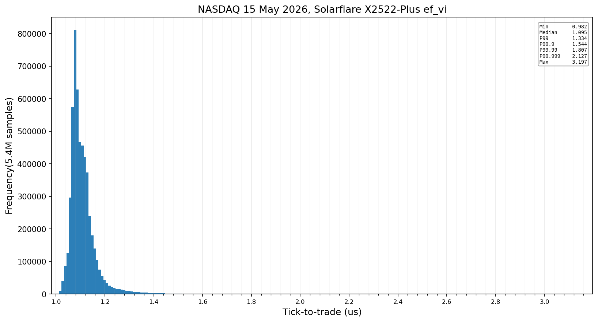
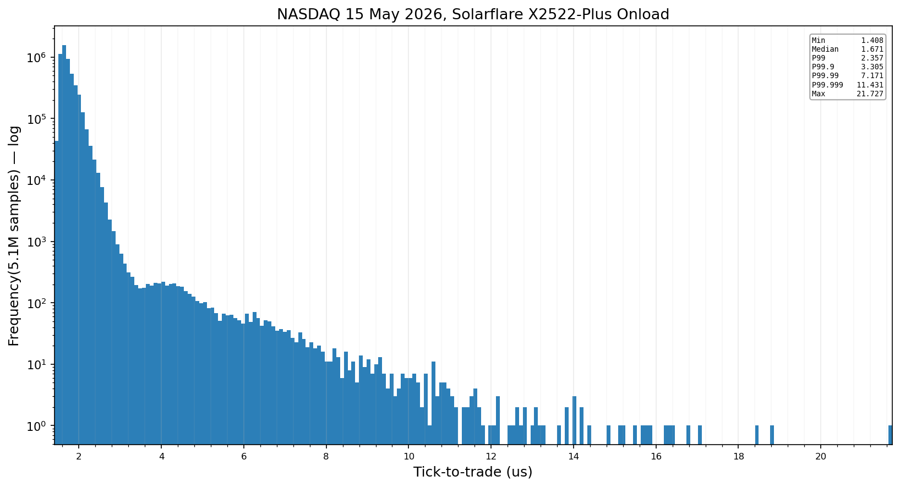

# Ultra Low Latency Order Book (abt-t2t)

A NASDAQ ITCH 5.0 feed handler that measures tick-to-trade using HW timestamping. The ITCH 5.0 data is replayed by the exchange
simulator that plays real data. Since GitHub is littered with "Order books", this one is different because it implements the full thing: a real exchange simulator,
linux kernel bypass(Solarflare `ef_vi`) and HW timestamped measurements all the way up to P99.999 and max. 

## Tick-to-trade, full trading day

NASDAQ, 15 May 2026, the whole session from the first message at 03:02 to the 16:00 close,
replayed at wall-clock pace, quoting eight symbols. Every sample is the NIC's receive stamp of
the market-data packet subtracted from the NIC's transmit stamp of the order it caused, on one
clock. Same tape, same rig, same DUT logic on both rows; only the transport differs.

### Solarflare X2522-Plus, `ef_vi`



5,370,758 samples, nothing dropped. 937.6 million market data packets, no gaps, no dropped or
stale frames, zero context switches on the hot core, zero CTPIO fallbacks, zero map rehashes,
and the simulator never fell more than 158 µs behind the tape. The single worst sample,
3,197 ns, is the simulator's close-of-day packet; the worst sample the market produced was
3,004 ns.

### Solarflare X2522-Plus, Onload



The same DUT built against plain BSD sockets and run under Onload with the low-latency
profile: spinning, interrupt-free, one stack per thread, CTPIO sends, hardware stamps through
`SO_TIMESTAMPING`. 5,117,062 samples, 854.6 million packets, no gaps, no drops in the Onload
stack or the kernel, every order matched to a transmit stamp. Fewer samples than the `ef_vi`
row because the longer acknowledgement path leaves more quote updates skipped while a replace
is still in flight.

## What is measured ?

Feed handler:

```
               ┌────────────── t2t = tx stamp − rx stamp ──────────────┐
               │                                                       │
          rx hw stamp                                             tx hw stamp
               │                                                       │
               ▼                                                       ▼
 ITCH   ┌─────────────┐  DMA   ┌──────┐  load  ┌────────┐ CTPIO ┌─────────────┐  OUCH
 ──────►│   NIC rx    │───────►│ DDR4 │───────►│ core 6 │──────►│   NIC tx    │──────►
        └─────────────┘hugepage└──────┘  DRAM  └────────┘  PIO  └─────────────┘
                                                    │
                                                    └──► MoldUDP64 frame, sequence check
                                                         ITCH 5.0 decode in place
                                                         order book update
                                                         quote decision
                                                         OUCH 5.0 build
```

Both timestamps are taken using a Solarflare X2522-Plus. The recieve timestamp is written when the ITCH market-data arrives on the 
wire. The transmit timestamp is written when the OUCH response leaves the NIC. 

Photos of the rig: [the two cards cabled back to back with the 25G DACs](docs/images/Server_backside.jpg),
[the X2522-25G Plus](docs/images/Solarflare_X2522_Plus.jpg) and [both cards seated in the
board, each under its own fan](docs/images/Upside_motherboard_shot.jpg).

## The latency critical tick-to-trade path 

Everything between the two hardware stamps runs on one thread, on one isolated core, with no
syscall, no lock, no allocation and no branch to code that is not on this path. This is the
`ef_vi` receive-to-send loop from `src/t2t/dut/DutSession.hpp`, trimmed of the
software-timing counters.

```cpp
void DutSession<Mode, Strat, Io>::poll()
    requires (Mode == IoMode::Transport && RxRing<Io> && TxRing<Io>)
{
    for (;;) {
        const auto raw = m_io.io->tryReceive();          // 1. next frame in the rx ring, or empty
        if (raw.empty()) {
            drainTxStamps();                             //    idle: collect tx stamps, keep spinning
            break;
        }
        const auto*       frame = raw.data();
        const auto*       p     = reinterpret_cast<const std::byte*>(raw.data());
        const std::size_t len   = net::udpPayloadLen(p, raw.size());
        prefetchFrame(frame, net::kL2L3L4Overhead + len);
        const std::uint64_t rxStamp = m_io.io->hwRxTimestamp();   // 2. NIC rx stamp from the 14-byte prefix
        const std::span<const std::byte> payload{p + net::kL2L3L4Overhead, len};
        if (udpDstPort(frame) == m_io.ackPort) {
            applyAck(payload);                           //    order-entry ack: update the slot state
        } else {
            if (raw.size() >= kGuardedFrame) {           // 3. payload-poll: the frame is read while the
                const volatile std::uint16_t* guard =    //    DMA is still landing, so spin on a word in
                    reinterpret_cast<const volatile std::uint16_t*>(frame + kGuardOffset);
                while (*guard == 0 && !m_io.io->rxFrameComplete()) {}   //    the second cache line
            }
            applyPacket(payload, rxStamp);               // 4. MoldUDP64 header, ITCH decode, book, quote
        }
        std::memset(const_cast<std::uint8_t*>(frame) + kGuardOffset, 0, sizeof(std::uint16_t));
        m_io.io->release();                              //    buffer back to the ring
    }
}
```

Inside `applyPacket` each ITCH message is applied to its book in place. When a quoted symbol's
top of book changes, the quote decision and the send happen before the next message is read:

```cpp
const auto quote = [&](std::size_t h) {
    const BookBuilder& book = m_books.hotBook(h);
    QuoteTargets       targets{};
    if (!m_strats[h].onBook(book, m_oms.account(h), targets)) {   // 5. strategy: is our quote mispriced?
        return;                                                    //    no: nothing to send
    }
    const std::size_t n = m_oms.reconcile(h, targets, m_out);     // 6. OMS: which side to replace, build OUCH
    for (std::size_t i = 0; i < n; ++i) {
        sendOrder({m_out[i].buf.data(), m_out[i].len});           // 7. straight into the NIC
    }
};
```

```cpp
bool DutSession<Mode, Strat, Io>::sendOrder(std::span<const std::byte> ouch) {
    const auto    frameLen = static_cast<std::uint32_t>(net::kL2L3L4Overhead + ouch.size());
    std::uint8_t* buf      = m_io.io->acquire(frameLen);           // 8. next CTPIO tx slot
    std::memcpy(buf, m_io.oeHeaders[headerKind(ouch.size())].data(), net::kL2L3L4Overhead);
    std::memcpy(buf + net::kL2L3L4Overhead, ouch.data(), ouch.size());   //    prebuilt Ethernet/IP/UDP header
    m_txSeq                           = m_io.io->txSequence();
    m_txRefs[m_txSeq & (kTxRefs - 1)] = TxRef{.seq = m_txSeq, .userRef = kNoRef};   // 9. remember which order
    m_io.io->commit();                                             // 10. 64-byte posted writes to the card
    return true;                                                   //     tx stamp arrives later, matched by seq
}
```

The functions for Rx(`tryReceive()`, `release()`) and Tx(`acquire()`, `commit()`) come from [ABTRDA3](https://github.com/ASherjil/ABTRDA3), 
which benchmarks `ef_vi`, Verbs, DPDK and AF_XDP on this same rig.

## How to run the exchange simulator

The simulator replays a real NASDAQ ITCH 5.0 day. It sends every message on the tape to the
DUT over MoldUDP64 on UDP, and takes the DUT's OUCH orders back. There are no command-line
arguments. Everything comes from `config/exchange_sim.toml`.

1. Get a day of NASDAQ TotalView-ITCH 5.0 data in BinaryFILE format, unzip it, and put it in
   `data/itch/`. The data is not in this repo, see `data/README.md`.
2. Build with `scripts/build.sh`. It asks three questions: clean or not, the build type
   (`release`, `release-hw` for hardware timestamps, `debug`), and which transports to build.
   Binaries land in `build/<type>/apps/`.
3. Edit `config/exchange_sim.toml`:
   - `[replay]`: `file` is the ITCH file. `skip_to` and `stop_at` pick the time-of-day window.
     `speed = 1.0` replays at real time. `loops = 1` plays the window once.
   - `[venue]`: `symbols` are the symbols the DUT is allowed to trade. Every symbol on the tape
     is still sent; these are the ones with a matching engine behind them.
   - Pick the transport. `[socket]` is for plain kernel sockets: market data goes to
     `md_host:md_port` over UDP and orders come in on TCP port `oe_port`. `[transport]`,
     `[network]`, `[market_data]` and `[order_entry]` are for the kernel-bypass binaries: the
     NIC, both MAC and IP addresses, and the UDP ports.
4. Run the binary for the transport you picked, from the repo root:

   ```bash
   build/release/apps/exchange_sim          # kernel sockets
   build/release/apps/exchange_sim_verbs    # ConnectX, libibverbs
   build/release/apps/exchange_sim_dpdk     # DPDK
   build/release/apps/exchange_sim_ef_vi    # Solarflare ef_vi
   ```

   It waits for the DUT to log in, then replays. It prints one status line per second and a
   summary at the end.

**Using the simulator on its own, without the DUT.** It works as a standalone ITCH replayer:
it reads the day and puts every message on the wire as MoldUDP64, at the real time of day or
as fast as it can. Set `wait_for_dut = false` under `[replay]` and start one of the
kernel-bypass binaries (`exchange_sim_verbs`, `exchange_sim_dpdk`, `exchange_sim_ef_vi`). It
sends to the `peer_mac`, `peer_ip` and `dst_port` in the config and needs nothing on the other
end. `speed = 0` replays as fast as possible, about a million messages a second. `loops = 0`
repeats the day until you stop it. Every message on the tape is sent, not just the symbols in
`[venue]`. The kernel-socket binary (`exchange_sim`) also needs one TCP connection on
`oe_port` before it starts, `nc <sim ip> 5001` is enough, then it streams UDP to
`md_host:md_port`. There is no retransmission server, so a receiver that drops a packet has
to handle the gap itself.

## How to run the DUT

The DUT is the feed handler and market maker. It receives ITCH over MoldUDP64, keeps the
books, quotes the configured symbols and sends OUCH orders. No command-line arguments.
Everything comes from `config/dut.toml`.

1. Build as above. Use `release-hw` for hardware-timestamped results. `release` adds software
   timers for development.
2. Edit `config/dut.toml`:
   - `[venue]`: `symbols` are the quoted symbols. The list must match the simulator's. Every
     other symbol on the tape is booked but not traded.
   - `[venue]`: `profile` points at a per-symbol profile that sizes the books before the session
     starts. Make it once with
     `build/release/apps/itch_replay data/itch/<file> --all --write-profile data/symbols.profile`.
     Leave it empty to size the books on the fly.
   - Pick the transport, the same way as the simulator. `[socket]` for kernel sockets:
     `md_bind_host:md_port` is where market data arrives, `oe_host:oe_port` is where orders go.
     `[transport]`, `[network]`, `[market_data]` and `[order_entry]` for kernel bypass.
   - `[measure]`: `log_file` is where the HdrHistogram log is written.
3. Start the simulator first, then run the DUT from the repo root:

   ```bash
   build/release-hw/apps/dut          # kernel sockets; the same binary under onload is the Onload row
   build/release-hw/apps/dut_verbs    # ConnectX, libibverbs
   build/release-hw/apps/dut_dpdk     # DPDK
   build/release-hw/apps/dut_ef_vi    # Solarflare ef_vi, the headline
   ```

   It prints one status line per second, a percentile line per minute, and the full report at
   the end: the latency table, per-symbol positions, and every counter a run is judged by.

To run both on one machine and collect the logs into `results/`, use
`sudo scripts/loopback_test.sh release-hw`. It reads both config files, launches both binaries,
and stops when the replay window ends.

## Methodology

[`docs/measurement-methodology.md`](docs/measurement-methodology.md) documents the full
measurement in detail: what is inside and outside the interval, the rig and its kernel
configuration, how the hardware timestamps are taken and matched, the feed handler's data
structures and their time complexity, the exchange simulator and how it decides fills by
queue position, the kernel-bypass transports, the NASDAQ session used, every thread, and
what is not claimed.

[`docs/bugs-found-by-benchmarking.md`](docs/bugs-found-by-benchmarking.md) lists every bug the
benchmarks exposed, how each one was found, what it did to the numbers, and how the fix was
verified.

## License

Apache-2.0. See [LICENSE](LICENSE) and [NOTICE](NOTICE).

NASDAQ TotalView-ITCH data is the property of Nasdaq, Inc. and is not included in this
repository.
