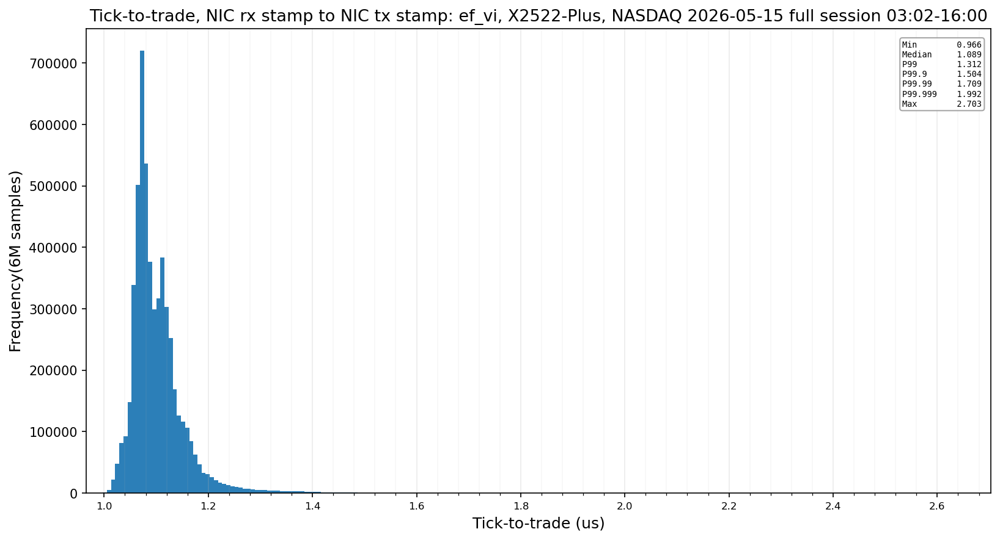

# Ultra Low Latency Order Book (abt-t2t)

A NASDAQ ITCH 5.0 feed handler that measures tick-to-trade using HW timestamping. The ITCH 5.0 data is replayed by the exchange
simulator that plays real data. Since GitHub is littered with "Order books", this one is different because it implements the full thing: a real exchange simulator,
linux kernel bypass(Solarflare `ef_vi`) and HW timestamped measurements all the way up to P99.999 and max. 

## Tick-to-trade, full trading day 

NASDAQ, 15 May 2026, the whole session from the first message at 03:02 to the 16:00 close,
replayed at wall-clock pace. Solarflare X2522-Plus, `ef_vi`, one order timed per quote update.



| | ns |
|---|---|
| samples | 5,413,430 |
| min | 966 |
| median | 1,089 |
| p99 | 1,312 |
| p99.9 | 1,504 |
| p99.99 | 1,709 |
| p99.999 | 1,992 |
| max | 2,703 |

Every sample is the NIC's receive stamp of the market-data packet subtracted from the NIC's
transmit stamp of the order it caused, on one clock. The run was clean: 936.8 million market
data packets, no gaps, no dropped or stale frames, zero context switches on the hot core,
zero CTPIO fallbacks, zero map rehashes, and the simulator never fell more than 149 µs behind
the tape.

## What is measured ?

Feed handler:

```
               ┌────────────── t2t = tx stamp − rx stamp ──────────────┐
               │                                                       │
          rx hw stamp                                             tx hw stamp
               │                                                       │
               ▼                                                       ▼
 ITCH   ┌─────────────┐  DMA   ┌──────┐  load  ┌────────┐ CTPIO ┌─────────────┐  OUCH
 ──────►│   NIC rx    │───────►│ DDR4 │───────►│ core 6 │──────►│   NIC tx    │──────►
        └─────────────┘hugepage└──────┘  DRAM  └────────┘  PIO  └─────────────┘
                                                    │
                                                    └──► MoldUDP64 frame, sequence check
                                                         ITCH 5.0 decode in place
                                                         order book update
                                                         quote decision
                                                         OUCH 5.0 build
```

Both timestamps are taken using a Solarflare X2522-Plus. The recieve timestamp is written when the ITCH market-data arrives on the 
wire. The transmit timestamp is written when the OUCH response leaves the NIC. 

### C++ code architecture

Ultra low latency is achieved by using kernel bypass combined with busy-polling. 

The sequence is as follows: 

1. Poll the receive ring, the CPU spinning at 100%.
2. Read the MoldUDP64 header and check the sequence against the tracker. Gaps are counted
   and surfaced, never silently absorbed.
3. Decode each ITCH 5.0 message in place, as a big-endian overlay on the received bytes.
   Nothing is copied into a parsed structure.
4. If the message belongs to a quoted symbol, apply it to that book here: add, execute,
   cancel, delete and replace are all constant-time on this path.
5. If it belongs to any other symbol, hand the frame to the second core and move on.
6. Ask the quoter whether the new top of book has moved its own quote out of position.
7. If it has, build the OUCH 5.0 order and write it into the card with CTPIO.
8. Only after the order is on the wire, push the latency sample onto a lock-free SPSC for
   the histogram thread.
9. The histogram thread is pinned on another CPU core where it stores the latency using HdrHistogram. 

**The strategy.** A resting two-sided quote on each quoted symbol, one level per side,
held near the touch. When the book moves, the order manager replaces the side that is now
mispriced, and it tracks the in-flight state of each side so a second order is never sent
against an unacknowledged one. The point of the strategy is not that it is profitable. It
is that it is a real decision made from a real book on every tick, so the measured path
includes a branch that has to be right.

**Hot and cold.** Eight symbols are quoted. Every other symbol on the tape, roughly twelve
and a half thousand of them, is still fully booked, on a second isolated core fed by a
lock-free ring of frame references. Those frames are read in place out of the receive
buffers, so nothing is copied to hand them over, and the ring is sized against the buffer
pool so a frame can never be recycled while the second core is still reading it. At the
busiest point of the session that side is carrying several million live orders.

### The quoted set

| symbol | what it is | top of book | resting orders |
|---|---|---|---|
| AAPL | Apple, mega-cap single stock | $297.25 | 37,603 |
| MSFT | Microsoft, deepest book of the eight | $415.14 | 86,364 |
| AMD | semiconductor, heavy message rate | $432.12 | 36,427 |
| INTC | low-priced semiconductor, heavy churn | $108.91 | 32,428 |
| QQQ | NASDAQ-100 ETF, NASDAQ-listed | $709.04 | 27,175 |
| SPY | S&P 500 ETF, NYSE Arca-listed | $739.95 | 768 |
| TQQQ | 3x leveraged NASDAQ-100 ETF | $75.36 | 26,909 |
| GOOGL | Alphabet, mega-cap single stock | $393.66 | 27,934 |

### Threads and CPU isolation

The application is multi-threaded with only one thread pinned to a specific isolated CPU core. The breakdown is as follows:

The CPU Intel Core i9-11900k contains 8 cores, this is how the threads were pinned. 

1. Core 3: Thread 1 Histogram thread for latency measurements. Thread 2 status thread for the exchange simulator status. These are not latency critical.
2. Core 4: Thread for the exchange simulator. 
3. Core 5: Thread for booking the cold symbols. 
4. Core 6: Thread for the feed handler. The most latency critical where tick-to-trade lives. 
5. Core 7: Thread for the socket implementation Solarflare Onload. (Not used for the kernel bypass version).

Core 0-2 are not isolated they are left for linux housekeeping. 

## Methodology

[`docs/measurement-methodology.md`](docs/measurement-methodology.md) documents the full
measurement in detail: what is inside and outside the interval, the rig and its kernel
configuration, how the hardware timestamps are taken and matched, the feed handler's data
structures and their time complexity, the exchange simulator and how it decides fills by
queue position, the kernel-bypass transports, the NASDAQ session used, every thread, and
what is not claimed.

Kernel bypass transports come from the sibling project
[ABTRDA3](https://github.com/ASherjil/ABTRDA3), which benchmarks `ef_vi`, Verbs, DPDK and
AF_XDP on this same rig.

## License

Apache-2.0. See [LICENSE](LICENSE) and [NOTICE](NOTICE).

NASDAQ TotalView-ITCH data is the property of Nasdaq, Inc. and is not included in this
repository.
